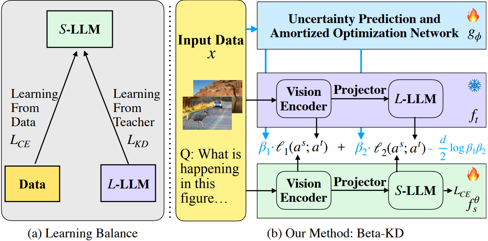

<div align="center">
<h1> [CVPR 2026] Uncertainty-Aware Knowledge Distillation for Multimodal Large Language
Models </h1>

[Jingchen Sun](https://jingchensun.github.io/)<sup>1, 2</sup>, [Shaobo Han](https://shaobohan.net/)<sup>2</sup>†, [Deep Patel](https://www.nec-labs.com/research/machine-learning/people/deep-patel/)<sup>2</sup>, [Wataru Kohno](https://www.nec-labs.com/research/optical-networking-sensing/people/wataru-kohno/)<sup>2</sup>, [Can Jin](https://jincan333.github.io/)<sup>3</sup>, [Changyou Chen](https://cse.buffalo.edu/~changyou/)<sup>1</sup>

<sup>1</sup> University at Buffalo, SUNY &nbsp;&nbsp; <sup>2</sup> NEC Laboratories America, Inc., USA &nbsp;&nbsp; <sup>3</sup> Rutgers University


[](https://github.com/Jingchensun/beta-kd)
[](https://github.com/Jingchensun/beta-kd) [](https://opensource.org/licenses/MIT)
</div>

## Introduction
We propose a novel uncertainty-aware knowledge distillation method, which can improve the performance of the student model by leveraging the uncertainty of the teacher model. [[Paper](https://github.com/Jingchensun/beta-kd)]
<div align="center">

</div>


## 📸 Release


* **`Mar. 24th, 2026`**: Our Beta-KD weights are uploaded on the HuggingFace website. We also provide inference examples so that anyone can enjoy [them](https://github.com/Jingchensun/beta-kd) early.
* **`Mar. 22th, 2026`**: The training and evaluation codes of Beta-KD are available now! Follow these  step-by-step instructions below to easily train your own Beta-KD in **20 hours** ⚡️ !
* **`Mar. 18th, 2026`:** 🔥🔥🔥 We release **Beta-KD: Uncertainty-Aware Knowledge Distillation for Multimodal Large Language
Models** on arxiv. Refer to **[our paper](https://github.com/Jingchensun/beta-kd)** for more details !

## 🦙 Model Zoo

#### Model Zoo
| Model | LLM | GQA | SQA<sup>I</sup> | VQA<sup>T</sup> | POPE | MME<sup>P</sup>  | MMB<sup>dev</sup> | Avg. |
|-------|-------|---|-------|-------|-------|-------|-------|-------|
| <div style="width: 93pt"> [Beta-KD-1.7B](https://github.com/Jingchensun/beta-kd)    | <div style="width: 91pt"> [MobileLLaMA 1.4B](https://huggingface.co/mtgv/MobileLLaMA-1.4B-Chat) | 56.1   | 57.3  | 41.5  | 84.5 | 1196.2 | 53.2    | 58.7 |
| [Beta-KD-MobileVLM 1.7B](https://github.com/Jingchensun/beta-kd) | [MobileLLaMA 1.4B](https://huggingface.co/mtgv/MobileLLaMA-1.4B-Chat) | **59.3**   | **66.7**  | **52.1**  | **84.3** | **1302.8** | **57.7**    | **64.2** |


## 🛠️ Install

Clone this repository and install conda environment
   ```bash
   git clone git@github.com:Jingchensun/beta-kd.git
   cd beta-kd
    
  conda create -n beta-kd python=3.10 -y
  conda activate beta-kd
  pip install --upgrade pip
  pip install -r requirements.txt
  ```

## Step-by-step Tutorial

### 1. Prepare Data
- For convenience, assume your working directory `/path/to/project/Beta-KD` as `work_dir`: 
  - `cd ${work_dir} && mkdir -p data/pretrain_data data/finetune_data data/benchmark_data`
- prepare pre-training data
  - `cd ${work_dir}/data/pretrain_data`
  - download the ShareGPT4V-PT from [here](https://huggingface.co/datasets/Lin-Chen/ShareGPT4V/blob/main/share-captioner_coco_lcs_sam_1246k_1107.json), which is provided by ShareGPT4V team.
- prepare multi-task training data
  - `cd ${work_dir}/data/finetune_data`
  - download the annotation of our Beta-KD_V2_FT_Mix2M data from huggingface [here](https://huggingface.co/datasets/mtgv/Beta-KD_V2_FT_Mix2M), and download the images from constituting datasets: 
  [Text-VQA](https://dl.fbaipublicfiles.com/textvqa/images/train_val_images.zip), 
  [IConQA](https://drive.google.com/file/d/1Xqdt1zMcMZU5N_u1SAIjk-UAclriynGx/edit), [SQA](https://drive.google.com/drive/folders/1w8imCXWYn2LxajmGeGH_g5DaL2rabHev), [SBU](https://huggingface.co/datasets/sbu_captions), follow [ShareGPT4V](https://github.com/InternLM/InternLM-XComposer/blob/main/projects/ShareGPT4V/docs/Data.md) to download images from:
  [LAION-CC-SBU-558K](https://huggingface.co/datasets/liuhaotian/LLaVA-Pretrain/blob/main/images.zip), [COCO](http://images.cocodataset.org/zips/train2017.zip), [WebData](https://drive.google.com/drive/folders/1tCUQ-sq6vdshZVkF0ZeF3K4eztkXJgax?usp=sharing), [SAM](https://drive.google.com/file/d/1dKumdOKSXtV7lIXdrG7jsIK_z2vZv2gs/view?usp=drive_link), [GQA](https://downloads.cs.stanford.edu/nlp/data/gqa/images.zip), [OCR-VQA](https://drive.google.com/drive/folders/1_GYPY5UkUy7HIcR0zq3ZCFgeZN7BAfm_?usp=sharing), [TextVQA](https://dl.fbaipublicfiles.com/textvqa/images/train_val_images.zip), [VisualGnome](https://cs.stanford.edu/people/rak248/VG_100K_2) ([Part1](https://cs.stanford.edu/people/rak248/VG_100K_2/images.zip), [Part2](https://cs.stanford.edu/people/rak248/VG_100K_2/images2.zip))

- prepare evaluation benchmark data
  - We evaluate models on a diverse set of 6 benchmarks, *i.e.* GQA, MMBench, MME, POPE, SQA, TextVQA. We do not evaluate using beam search to make the inference process consistent with the chat demo of real-time outputs. You should follow these instructions to manage the datasets.
  - <details>
    <summary> Data Download Instructions </summary>

    - download some useful [data/scripts](https://github.com/Meituan-AutoML/Beta-KD/releases/download/v0.1/benchmark_data.zip) pre-collected by us.
      - `unzip benchmark_data.zip && cd benchmark_data`
      - `bmk_dir=${work_dir}/data/benchmark_data`
    - gqa
      - download its image data following the official instructions [here](https://cs.stanford.edu/people/dorarad/gqa/download.html)
      - `cd ${bmk_dir}/gqa && ln -s /path/to/gqa/images images`
    - mme
      - download the data following the official instructions [here](https://github.com/BradyFU/Awesome-Multimodal-Large-Language-Models/tree/Evaluation).
      - `cd ${bmk_dir}/mme && ln -s /path/to/MME/MME_Benchmark_release_version images`
    - pope
      - download coco from POPE following the official instructions [here](https://github.com/AoiDragon/POPE/tree/e3e39262c85a6a83f26cf5094022a782cb0df58d/output/coco).
      - `cd ${bmk_dir}/pope && ln -s /path/to/pope/coco coco && ln -s /path/to/coco/val2014 val2014`
    - sqa
      - download images from the `data/scienceqa` folder of the ScienceQA [repo](https://github.com/lupantech/ScienceQA).
      - `cd ${bmk_dir}/sqa && ln -s /path/to/sqa/images images`
    - textvqa
      - download images following the instructions [here](https://dl.fbaipublicfiles.com/textvqa/images/train_val_images.zip).
      - `cd ${bmk_dir}/textvqa && ln -s /path/to/textvqa/train_images train_images`
    - mmbench
      - no action is needed.

    </details>

- organize the `data` directory as follows after downloading all of them: 
  - <details>
    <summary> Data Structure Tree </summary>

    ```
    .
    ├── benchmark_data
    │   ├── gqa
    │   │   ├── convert_gqa_for_eval.py
    │   │   ├── eval.py
    │   │   ├── images -> /path/to/your/gqa/images
    │   │   ├── llava_gqa_testdev_balanced.jsonl
    │   │   └── testdev_balanced_questions.json
    │   ├── mmbench
    │   │   ├── convert_mmbench_for_submission.py
    │   │   ├── eval.py
    │   │   └── mmbench_dev_en_20231003.tsv
    │   ├── mme
    │   │   ├── calculation.py
    │   │   ├── convert_answer_to_mme.py
    │   │   ├── images -> /path/to/your/MME/MME_Benchmark_release_version
    │   │   └── llava_mme.jsonl
    │   ├── pope
    │   │   ├── coco -> /path/to/your/pope/coco
    │   │   ├── eval.py
    │   │   ├── llava_pope_test.jsonl
    │   │   └── val2014 -> /path/to/your/coco/val2014
    │   ├── sqa
    │   │   ├── eval.py
    │   │   ├── images -> /path/to/your/scienceqa/images
    │   │   ├── llava_test_CQM-A.json
    │   │   ├── pid_splits.json
    │   │   └── problems.json
    │   └── textvqa
    │       ├── eval.py
    │       ├── llava_textvqa_val_v051_ocr.jsonl
    │       ├── TextVQA_0.5.1_val.json
    │       └── train_images -> /path/to/your/textvqa/train_images
    ├── finetune_data
    │   ├── llava_v1_5_mix665k.json
    │   ├── Beta-KD_V2_FT_Mix2M.json
    │   ├── coco
    │   │   ├── train2017
    │   │   └── val2017
    │   ├── gqa
    │   │   └── images
    │   ├── iconqa_data
    │   │   └── iconqa
    │   │       └── train
    │   │           ├── choose_img
    │   │           ├── choose_txt
    │   │           └── fill_in_blank
    │   ├── ocr_vqa
    │   │   └── images
    │   ├── sam
    │   │   └── images
    │   ├── SBU
    │   │   └── images
    │   ├── ScienceQA
    │   │   └── train
    │   ├── share_textvqa
    │   │   └── images
    │   ├── textvqa
    │   │   └── train_images
    │   ├── vg
    │   │   ├── VG_100K
    │   │   └── VG_100K_2
    │   ├── web-celebrity
    │   │   └── images
    │   ├── web-landmark
    │   │   └── images
    │   └── wikiart
    │       └── images
    └── pretrain_data
        ├── share-captioner_coco_lcs_sam_1246k_1107.json
        ├── blip_laion_cc_sbu_558k.json
        ├── images
        ├── coco
        │   └── train2017
        ├── llava
        │   └── llava_pretrain
        └── sam
            └── images
    ```
    </details>

### 2. Training and Evaluation

#### 2.1 Evaluation


Evaluate a Hugging Face model on a single dataset (e.g. ScienceQA):
```shell
bash scripts/benchmark.sh jsun39/AlignKD-Pretrain-1246k eval-results "sqa"
```

Evaluate a local finetuned model on a single dataset (e.g. ScienceQA):
```shell
bash scripts/benchmark.sh outputs-finetune/finetune/checkpoint-18000 eval-results "sqa"
```

Evaluate a Hugging Face model on all 6 benchmark datasets:
```shell
bash scripts/benchmark.sh jsun39/AlignKD-Pretrain-1246k eval-results
```

Evaluate a local finetuned model on all 6 benchmark datasets:
```shell
bash scripts/benchmark.sh outputs-finetune/finetune/checkpoint-18000 eval-results
```

#### 2.2 Training


#### Training Overview

The training process of Beta-KD V2 is divided into two stages:

- stage I: pre-training
  - Setup: ❄️ frozen vision encoder + 🔥 **learnable** LDP V2 projector + ❄️ frozen LLM
  - Time: around **21 hours** on 4x H100 (80G), or **25 hours** on 4x A100 (80G)
  - Batch setting:
    ```bash
    --per_device_train_batch_size 1 \
    --gradient_accumulation_steps 32
    ```
  - Memory: approximately 29G / 80G GPU memory

- stage II: multi-task training
  - Setup: ❄️ frozen vision encoder + 🔥 **learnable** LDP V2 projector + 🔥 **learnable** LLM
  - Time: around **14 hours** on 4x H100 (80G), or **27 hours** on 4x A100 (80G)
  - Batch setting:
    ```bash
    --per_device_train_batch_size 1 \
    --gradient_accumulation_steps 32
    ```
  - Memory: approximately 29G / 80G GPU memory


**Default setting** — follows the AlignKD paper, with equal loss weighting across two training stages:
```shell
bash 1_pretrain.sh 1 align-kd equal
bash 2_finetune.sh 1 align-kd equal
```

**Beta-KD with task-level uncertainty weighting:**
```shell
bash 1_pretrain.sh 1 align-kd task
bash 2_finetune.sh 1 align-kd task
```

**Beta-KD with instance-conditional weighting:**
```shell
bash 1_pretrain.sh 1 align-kd instance
bash 2_finetune.sh 1 align-kd instance
```

All available argument options:

| Argument | Description | Options |
|----------|-------------|---------|
| `DISTILL` | Enable knowledge distillation | `1` (enable), `0` (disable) |
| `DISTIL_KL` | Distillation loss type | `align-kd`, `fkl`, `rkl`, `tvd`, `js`, `mse`, `mse-probs`, `cosine`, `cosine-probs`, `adaptive_kl`, `sfkl`, `srkl`, `ctkd`, `ctkd-mlp`, `dkd`, `taid` |
| `DISTIL_Weighting` | Loss weighting strategy | `equal` / `type1` (uniform), `task` / `type2` (task-level uncertainty), `instance` / `type3` (instance-conditional) |


## 🤝 Acknowledgments
- [MobileVLM](https://github.com/Meituan-AutoML/MobileVLM): the codebase we built upon. Thanks for their wonderful work! 👏
- [Align-KD](https://github.com/fqhank/Align-KD): the baseline work we refer to!
- [TAID](https://github.com/SakanaAI/TAID): some kl loss implementation are borrow from this code base!


## ✏️ Reference

If you find Beta-KD useful in your research or applications, please consider giving a star ⭐ and citing using the following BibTeX:
```
@inproceedings{sun2026uncertainty,
  title={Uncertainty-Aware Knowledge Distillation for Multimodal Large Language Models},
  author={Sun, Jingchen and Han, Shaobo and Patel, Deep and Kohno, Wataru and Jin, Can and Chen, Changyou},
  booktitle={Proceedings of the IEEE/CVF Conference on Computer Vision and Pattern Recognition (CVPR)},
  year={2026}
}
```
